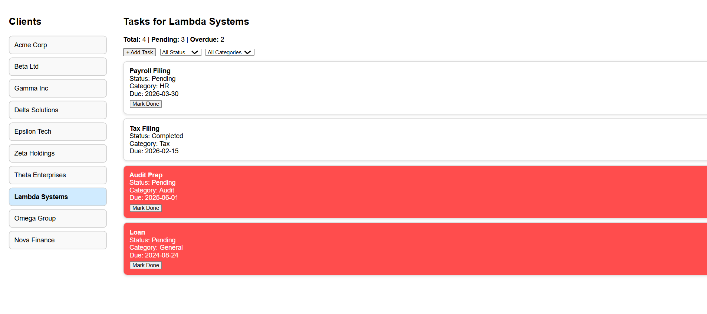

# Mini Compliance Tracker

A simple full-stack web application to manage compliance tasks for multiple clients.

---

## 🔗 Live Demo

Frontend: https://compliance-tracker-blush.vercel.app/ //
Backend: https://compliance-tracker-gpfw.onrender.com

---

## 📌 Features

### Clients
- View list of clients
- Select a client to manage tasks

### Tasks
- View tasks for selected client
- Add new tasks
- Mark tasks as Completed
- Filter tasks by:
  - Status (Pending / Completed)
  - Category (Tax / Compliance / Audit / HR)

### Insights
- Total tasks count
- Pending tasks count
- Overdue tasks count

### Overdue Highlighting
- Pending tasks past due date are clearly highlighted in red

---

## 🛠️ Tech Stack

**Frontend**
- React (Vite)
- Axios

**Backend**
- Node.js
- Express

**Database**
- SQLite (lightweight, no setup required)

---

## ⚙️ Setup Instructions

### 1. Clone Repository

```bash
git clone https://github.com/rakshanayak24/mini-compliance-tracker.git
cd mini-compliance-tracker
```

### 2. Backend Setup
```bash
cd backend
npm install
node server.js
```
Backend runs on:
```bash
http://127.0.0.1:5000
```

### 3. Frontend Setup
```bash
cd frontend
npm install
npm run dev
```

Frontend runs on:
```bash
http://localhost:5173
```

### Data Models
## Client
  - id
  - company_name
  - country
  - entity_type
## Task
  - id
  - client_id
  - title
  - category
  - due_date
  - status

### API Endpoints
Get all clients
```bash
GET /clients
```

Get tasks for a client
```bash
GET /tasks/:client_id
```

Create task
```bash
POST /tasks
```

Update task status
```bash
PUT /tasks/:id
```
### Tradeoffs
- Used SQLite for simplicity and zero configuration
- Minimal UI to focus on functionality and clarity
- No authentication (out of scope for assignment)

### Assumptions
- Single-user system
- Tasks belong to one client only
- Status is either "Pending" or "Completed"

### Future Improvements
- Add task editing & deletion
- Add search functionality
- Add sorting (by due date, priority)
- Authentication & multi-user support
- Better UI (Tailwind / component library)

### Screenshots

